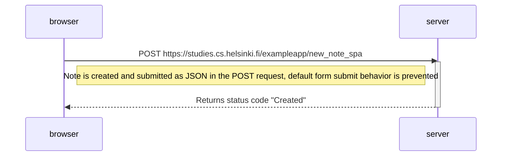

```mermaid
sequenceDiagram
    participant browser
    participant server
    
    browser->>server: POST https://studies.cs.helsinki.fi/exampleapp/new_note_spa
    activate server
    Note right of browser: Note is created and submitted as JSON in the POST request, default form submit behavior is prevented
    server-->>browser: Returns status code "Created"
    deactivate server         
```
