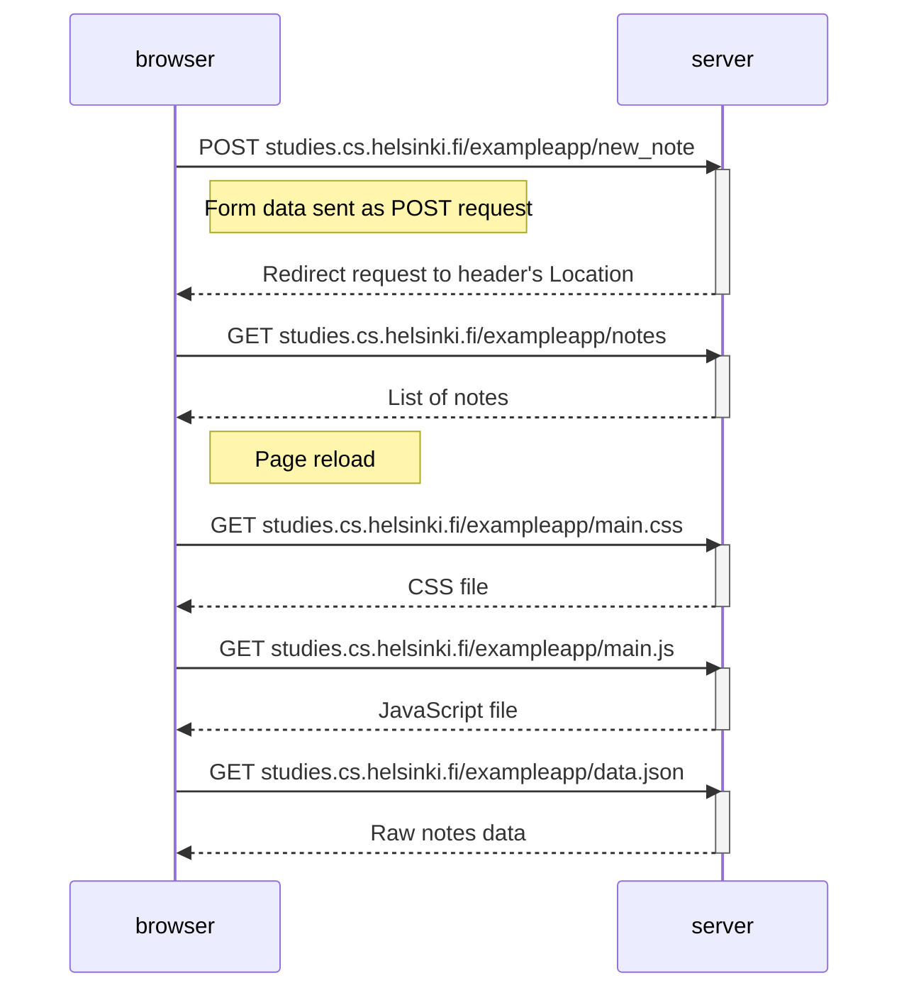

```mermaid
sequenceDiagram
    participant browser
    participant server
    
    browser->>server: POST studies.cs.helsinki.fi/exampleapp/new_note
    activate server
    Note right of browser: Form data sent as POST request
    server-->>browser: Redirect request to header's Location
    deactivate server    
    
    browser->>server: GET studies.cs.helsinki.fi/exampleapp/notes
    activate server
    server-->>browser: List of notes
    deactivate server

    Note right of browser: Page reload
    
    browser->>server: GET studies.cs.helsinki.fi/exampleapp/main.css
    activate server
    server-->>browser: CSS file
    deactivate server
    
    browser->>server: GET studies.cs.helsinki.fi/exampleapp/main.js
    activate server
    server-->>browser: JavaScript file
    deactivate server

    browser->>server: GET studies.cs.helsinki.fi/exampleapp/data.json
    activate server
    server-->>browser: Raw notes data
    deactivate server    
```
